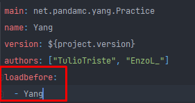

**YangAPI**

_¿How to create my private KnockbackProfiler from my private Spigot?_

- You have to create your own project in Intellij, Eclipse, etc.


- In plugin.yml put it to load after Yang, for example: 

    
  

- Create a room implementing KnockbackProfile
  ```Java
  import net.pandamc.yang.knockback.KnockbackProfiler;
  import org.bukkit.entity.Player;
  
  public class YourSpigotKnockback implements KnockbackProfiler {
  
      @Override
      public void setKnockback(Player player, String kb) {
      //Insert your code
      }
  
  }
  ```
  

- In the main class you have created, in the onEnable section register your KnockbackProfiler class 
    ```Java
    public class Main extends JavaPlugin {

    @Override
    public void onEnable() {
        YangAPI.setKnockbackProfile(new YourSpigotKnockback());
    }

    @Override
    public void onDisable() { }
  }
```